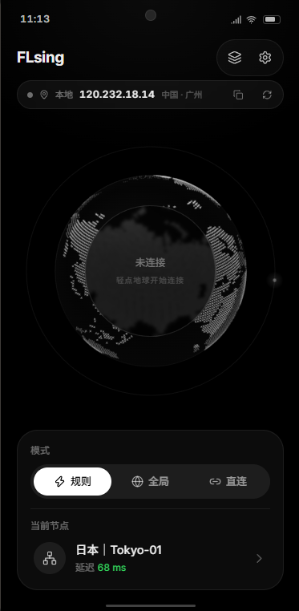
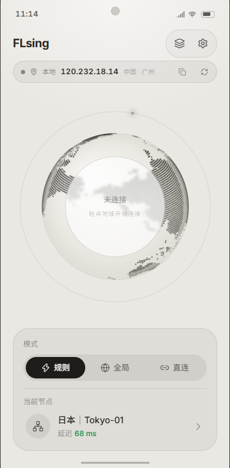
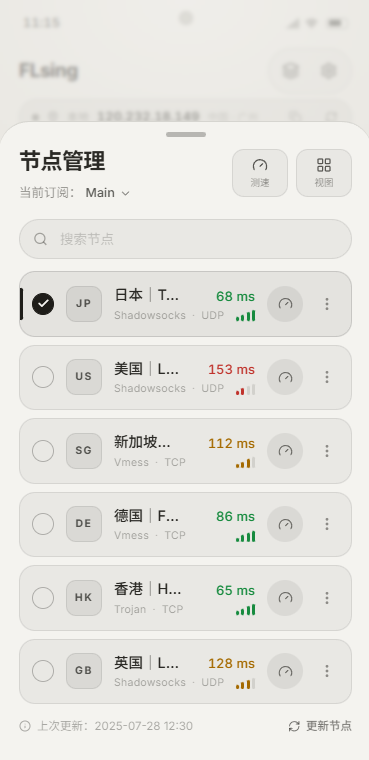
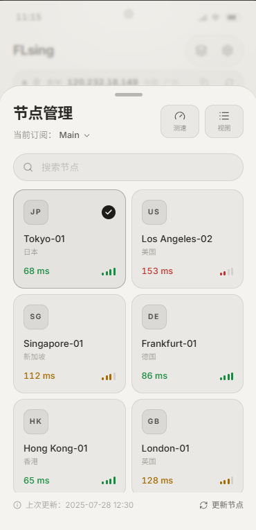
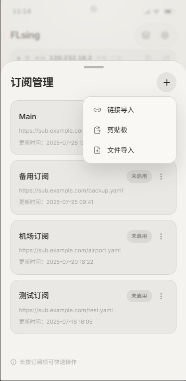

<p align="center">
  
</p>

<h1 align="center">FLsing</h1>

<p align="center">
  <strong>一个安静、易上手的 Android sing-box 客户端</strong><br>
  <strong>A quiet, approachable sing-box client for Android.</strong>
</p>

<p align="center">
  <a href="https://github.com/WEP-56/FLsing/releases"></a>
  <a href="https://github.com/WEP-56/FLsing/blob/main/readme.md"></a>
  <a href="#mit"></a>
</p>

<p align="center">
  <a href="#中文">中文</a> · <a href="#english">English</a>
</p>

<p align="center">
  <a href="https://wep-56.github.io/FLsing/"><strong>在线界面预览 / Live Preview</strong></a>
</p>

---

<a id="中文"></a>

## 中文

FLsing 面向希望快速、稳定使用代理的 Android 用户。导入订阅后即可选择节点并连接；常用项保持简洁，网络覆写、DNS 与 TUN 参数集中在独立的高级页面中，默认不改变订阅提供的配置。

> 当前优先支持 Android。请只导入你信任的订阅或配置文件，并了解所在地适用的法律与服务条款。

### 界面预览 / Interface Gallery

<p align="center">
  
  
  
</p>
<p align="center">
  
  
</p>

点击 [在线界面预览](https://wep-56.github.io/FLsing/) 可体验设计稿中的连接、节点、订阅和设置交互。该预览是前端演示，不会创建 VPN 连接或处理真实订阅。界面预览不代表实际安装后的真实功能

### 功能

- 订阅链接与本地配置导入，节点选择与规则/全局/直连模式切换。
- 智能、直连 TCP 与内核测速方式；支持全节点测速与可用节点的独立 TCP 测速。
- 自动重连与“启动后自动连接”，始终尊重用户主动断开。
- 分应用代理白名单/黑名单、系统 HTTP 代理、通知栏实时速率与电池优化引导。
- 订阅自动更新策略：更新间隔、仅 Wi-Fi、失败重试与最近失败原因。
- DNS 覆写：使用订阅、FLsing 默认或手动 DoH/DoT；可配置解析策略、缓存、FakeIP 与客户端子网。
- TUN 覆写：MTU、协议栈、自动/严格路由、嗅探、接口地址与排除路由。
- 连接诊断、脱敏日志导出、设置备份与恢复。
- 仅手动检查应用更新：`设置 → 关于 → 版本`，不会自动下载或安装更新。

### 安装

1. 前往 [Releases](https://github.com/WEP-56/FLsing/releases) 下载最新 APK。
2. 大多数手机选择 `arm64-v8a`；不确定设备 ABI 时选择 `universal`。
3. 在 Android 系统安装页确认安装，并在首次连接时授予 VPN 权限。

### 快速开始

1. 打开右上角的订阅管理，导入订阅链接或本地配置文件。
2. 在节点面板选择节点和代理模式。
3. 点击主界面的连接按钮，确认 Android VPN 授权。
4. 需要排查问题时，进入 `设置 → 诊断` 查看、复制或分享已脱敏的日志与连接快照。

### 高级网络设置

高级网络中的改动会先生成候选配置，并通过 sing-box 内核校验。校验失败时不会覆盖当前使用中的配置。

- **DNS**：默认使用订阅配置；启用覆写后可选择 FLsing 默认 DNS 或手动 DoH/DoT。
- **TUN 参数**：默认完整保留订阅值；开启自定义后，保存会在已连接时短暂重载 VPN，未连接时在下次连接生效。
- **分应用代理**：依赖 Android 的应用可见性权限；请在目标分发渠道发布前确认相关政策。

### 免责声明与合规

FLsing 是开源客户端软件，不运营、不出售、也不提供任何代理节点、订阅链接、网络流量、账号或绕过限制的服务。应用中的连接目标、订阅内容、节点可用性和由此产生的数据处理，均由用户自行选择的第三方服务或配置决定，与本项目维护者无关。

使用者应在安装、导入配置和建立连接前，自行确认并持续遵守所在地及连接目标所在地适用的法律法规、网络与电信监管要求、出口管制规则，以及网络、订阅和内容服务提供方的条款。尤其在对网络连接、跨境数据传输或加密通信有特别规定的司法辖区，使用者应自行取得所需授权。请勿将本项目用于任何违法、侵权、规避监管、未获授权访问或违反第三方服务条款的活动。

本项目按“现状”和“可用”基础提供，不保证任何配置的安全性、合法性、持续可用性、速度、隐私效果或对特定用途的适用性。使用者应自行评估风险、保护设备和配置中的敏感信息，并对使用行为及其后果负责。在适用法律允许的最大范围内，项目维护者不对因使用、无法使用或依赖本项目及其第三方配置而产生的损失承担责任；本声明不排除任何依法不得排除或限制的责任。

本说明不是法律意见。对具体合规问题，请咨询有资质的法律或合规专业人士。

### 开发

环境要求：Flutter SDK（Dart `^3.11.5`）、Android SDK 和 JDK 17。

```powershell
flutter pub get
flutter analyze
flutter test
```

推送 `v*` 标签会触发 GitHub Actions：运行分析与测试后，构建 ABI 拆分 APK 和 universal APK，并创建 GitHub Release。

### 路线图

- 已完成：连接可靠性、诊断、订阅与节点管理、分应用代理、设置备份、DNS/TUN 高级覆写。
- 进行中：路由规则、复杂 DNS 规则、自动选优参数、日志/缓存维护与手动更新通道。
- 规划中：Root 重定向、本地代理服务、原始配置编辑、Clash API 与 Shizuku 支持。

详情见 [设置路线图](docs/Settings-Roadmap.md)。

---

<a id="english"></a>

## English

FLsing is an Android client for people who want a reliable proxy experience without starting from a wall of network options. Import a subscription, choose a node, and connect. Advanced overrides for DNS and TUN live on their own pages and preserve the subscription configuration by default.

> Android is the current priority. Only import subscriptions and configuration files you trust, and comply with applicable laws and service terms.

### Preview

The [live interface preview](https://wep-56.github.io/FLsing/) demonstrates the connection, node, subscription, and settings interactions shown in the gallery above. It is a front-end demonstration only: it does not create VPN connections or process real subscriptions.

### Highlights

- Import subscription links and local configuration files; select nodes and switch between rule, global, and direct modes.
- Smart, direct TCP, and core-backed latency modes, with full-group testing and independent TCP tests for eligible nodes.
- Auto reconnect and optional connect-on-launch behavior that always respects a manual disconnect.
- Per-app include/exclude lists, system HTTP proxy support, live notification rates, and battery-optimization guidance.
- Subscription refresh controls for interval, Wi-Fi-only updates, retries, and the latest failure reason.
- DNS overrides: keep the subscription, use the FLsing preset, or configure manual DoH/DoT with strategy, cache, FakeIP, and client subnet controls.
- TUN overrides for MTU, stack, auto/strict routing, sniffing, interface addresses, and excluded routes.
- Connection diagnostics, sanitized log export, and settings backup/restore.
- Updates are manual only: use `Settings → About → Version`. FLsing never checks, downloads, or installs updates automatically.

### Install

1. Download the newest APK from [Releases](https://github.com/WEP-56/FLsing/releases).
2. Choose `arm64-v8a` for most phones, or `universal` when the device ABI is unknown.
3. Confirm installation in Android and grant VPN permission on the first connection.

### Getting Started

1. Open Subscription Management from the upper-right corner and import a subscription link or local configuration file.
2. Open the node panel to choose a node and proxy mode.
3. Tap the connection control on the home screen and approve Android VPN permission.
4. For troubleshooting, open `Settings → Diagnostics` to inspect, copy, or share a sanitized log and connection snapshot.

### Advanced Network Settings

Changes in Advanced Network build a candidate configuration first and validate it with the sing-box core. A failed validation never replaces the active configuration.

- **DNS** keeps the subscription by default. When overridden, choose the FLsing preset or a manual DoH/DoT endpoint.
- **TUN settings** preserve all subscription values until custom overrides are enabled. Saving while connected briefly reloads the VPN; otherwise, changes apply on the next connection.
- **Per-app proxy** relies on Android package visibility. Review the target store policy before distribution.

### Disclaimer and Compliance

FLsing is open-source client software. It does not operate, sell, or provide proxy nodes, subscription links, network traffic, accounts, or any service intended to bypass restrictions. Connection targets, subscription content, node availability, and any resulting data processing are determined by third-party services or configurations selected by the user, not by this project or its maintainers.

Before installing the app, importing a configuration, or connecting, users are responsible for determining and continuously complying with the laws and regulations of their location and the connection destination, including network and telecommunications rules, export-control requirements, and the terms of network, subscription, and content providers. This is especially important in jurisdictions with specific requirements for network connections, cross-border data transfers, or encrypted communications. Do not use FLsing for unlawful, infringing, regulatory-evasion, unauthorized-access, or third-party-terms-violating activity.

The project is provided on an "as is" and "as available" basis. It makes no warranty that any configuration is secure, lawful, continuously available, fast, private, or fit for a particular purpose. Users must assess their own risks, protect devices and sensitive configuration data, and remain responsible for their use and its consequences. To the maximum extent permitted by applicable law, the maintainers are not liable for loss arising from use of, inability to use, or reliance on this project or third-party configurations; nothing here excludes liability that cannot lawfully be excluded or limited.

This notice is not legal advice. Seek qualified legal or compliance advice for a specific situation.

### Development

Requirements: Flutter SDK (Dart `^3.11.5`), Android SDK, and JDK 17.

```powershell
flutter pub get
flutter analyze
flutter test
```

Pushing a `v*` tag triggers GitHub Actions. The workflow runs analysis and tests, builds split and universal APKs, and creates a GitHub Release.

### Roadmap

- Done: connection resilience, diagnostics, subscriptions and nodes, per-app proxy, settings backup, and advanced DNS/TUN overrides.
- In progress: routing rules, advanced DNS rules, URL-test tuning, log/cache maintenance, and a manual update channel selector.
- Planned: Root redirect, local proxy service mode, raw configuration editing, Clash API, and Shizuku support.

See the [Settings Roadmap](docs/Settings-Roadmap.md) for detail.

## 致谢
本项目安卓端核心插件：[flutter_sing_box](https://pub.dev/packages/flutter_sing_box)

## MIT
MIT License
